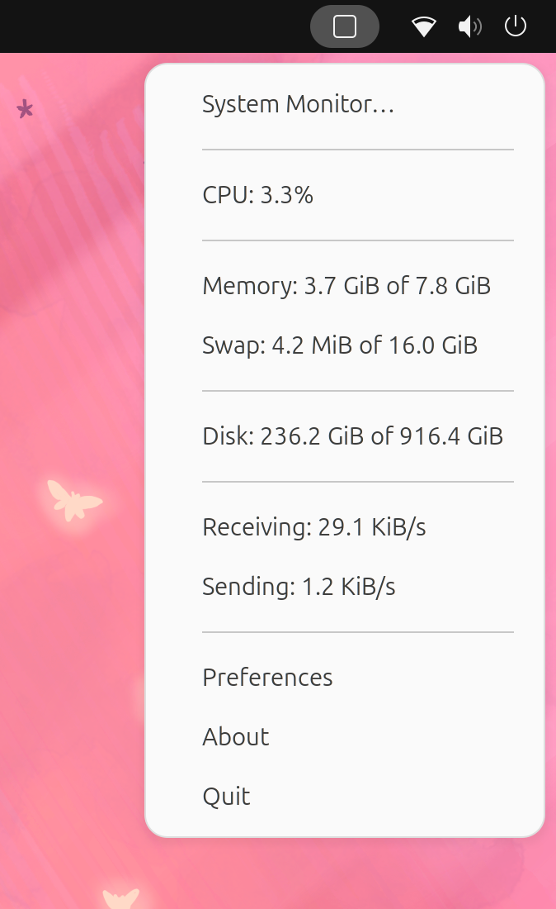

 

# SysPeek

SysPeek is a system monitor indicator that displays CPU usage memory usage, swap usage, disk usage and network traffic.

## Indicator Icon

The indicator icon displays the CPU usage.

<table>
  <tr align="center">
    <td></td>
    <td></td>
    <td></td>
    <td></td>
    <td></td>
    <td></td>
    <td></td>
    <td></td>
    <td></td>
    <td></td>
    <td></td>
  </tr>
  <tr align="center">
    <td>0%</td>
    <td>10%</td>
    <td>20%</td>
    <td>30%</td>
    <td>40%</td>
    <td>50%</td>
    <td>60%</td>
    <td>70%</td>
    <td>80%</td>
    <td>90%</td>
    <td>100%</td>
  </tr>
</table>

## Menu

The menu provides quick access to the system monitor and displays CPU usage memory usage, swap usage, disk usage and network traffic

## Configuration

SysPeek can be configured through the preferences dialog.

### CPU
* Update interval
* Display average load
* Display load for each core

### Memory
* Update interval
* Display memory usage
* Display Swap usage

### Disk
* Update interval
* Add/remove disks

### Network
* Update interval
* Display network speed
* Display total traffic

## Installation

### Ubuntu

SysPeek can be installed on Ubuntu through the [SysPeek PPA](https://launchpad.net/~vicox/+archive/ubuntu/syspeek).

Add the PPA:

    sudo add-apt-repository ppa:vicox/syspeek
    sudo apt update

Install SysPeek:

    sudo apt install syspeek

### From Source

You can download the latest version from the [release page](https://github.com/vicox/syspeek/releases) and install it with the setup file.

Install dependencies:

        sudo apt install python3-setuptools

Run setup:

        ./setup.py install
